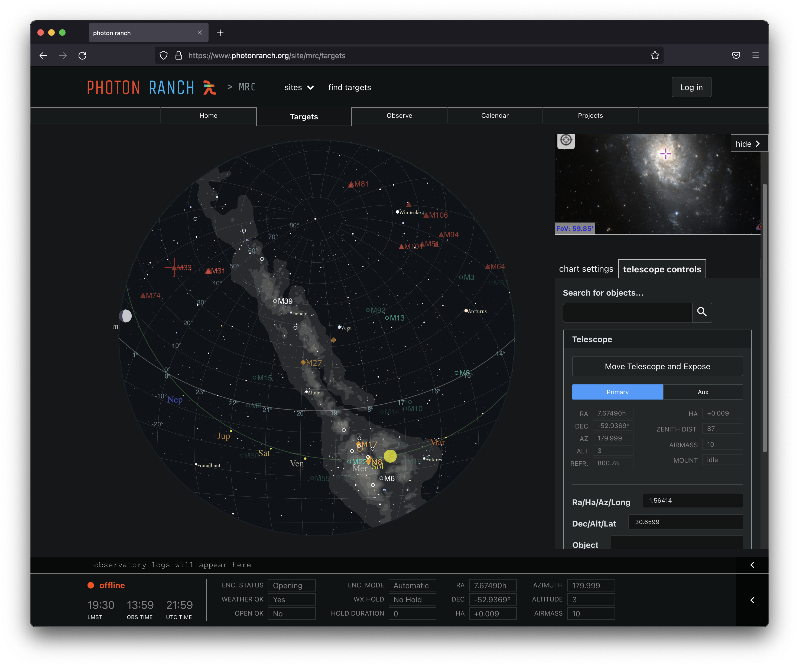
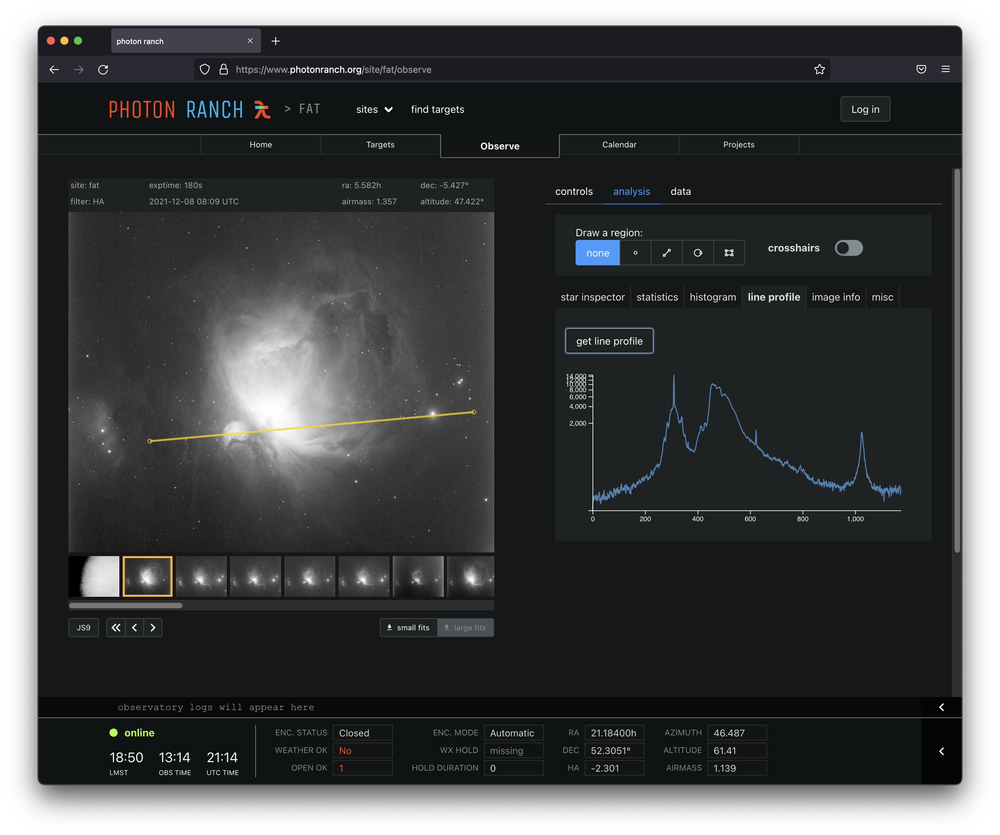
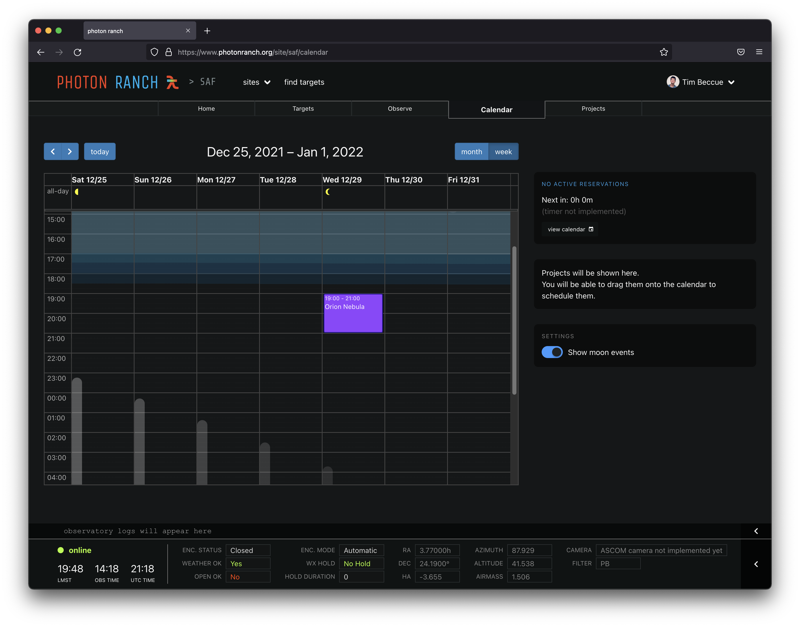
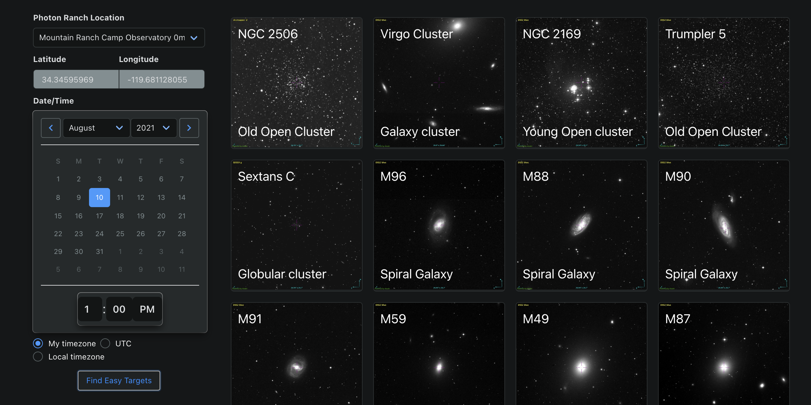

# Photon Ranch UI


This is the web interface used to access photon ranch observatories.

You can interact with the site at www.photonranch.org, or start up your own local server.

## Description

Photon Ranch is a global network of telescopes, created for middle and high school students to learn observational astronomy. 
This web application is the portal where users can control telescopes in real time, schedule long-running observation
projects, organize the data they've acquired, and interpret the data using a variety of data analysis tools.

## Local Development

### Required

You will need npm or a similar package manager to run this vue project.

### Run a local instance

To run the project, first clone the repository and install the dependencies:

```bash
git clone https://github.com/LCOGT/ptr_ui.git
cd ptr_ui
npm install
```

Run a local instance with:

```bash
npm run serve
```

## Configuration

Api endpoint urls used by the frontend are configured in the vuex module in `src/store/modules/api_endpoints.js`.
This provides a mechanism for dynamically toggling between different urls.

The backend services defined here and used for the main deployment (and set by default) are:
- General site communication: https://api.photonranch.org
- Sending commands: https://jobs.photonranch.org
- Calendar: https://calendar.photonranch.org
- Creating and managing projects: https://projects.photonranch.org
- Site and instrument status: https://status.photonranch.org
- Live site operation log stream: https://logs.photonranch.org
- Image analysis: https://quickanalysis.photonranch.org

## Authentication

User authentication and authorization is handled by Auth0. The configuration for this is specified in the file `auth_config.json`.

## Screenshots






